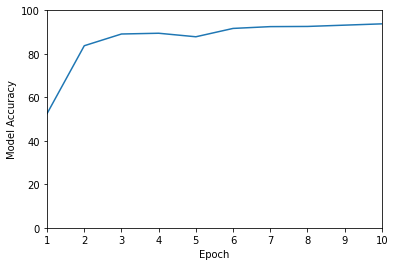
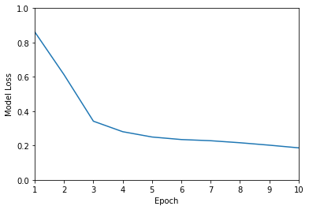

# CZ4171 IOT project

Mask detection program to detect if the user is wearing a mask. The app will take in a real-time image of the user and sends them to a remote Flask server for inference. [Video](https://youtu.be/EAvAU5ojfM4)


## File structure
```
iot-face-detection
│   README.md
└───face_detection (Machine learning)
│   │   faceMask_detection.ipynb
│   
└───iot_app (front-end)
│   │   App.js
│
└───server (flask)
│   │   app.py
│   │   inference.py
│   │   model_state_dict.pt
│   │
│   └───models 
│       │   face_detect.py
```
## 1 Tasks
1) Local inference  
[x] Collect user input, camera feed  
[x] Infer locally and display result  
[x] Run on emulated/physical IoT device   

2) Cloud inference  
[x] Run inference in cloud virtual machine (own computer)  
[x] Communicate between IoT device & cloud    

3) Advanced tasks    
[x] train your own model (face detection)  
[x] Support multiple concurrent users

## 2 Dependencies
### 2.1 Front-end
Requirements
- [NodeJs](https://nodejs.org/en/)
- [Expo](https://docs.expo.dev/get-started/installation/)

Setup
```
cd iot_app
npm i
```
### 2.2 Server
Requirements
- [Python3.8](https://www.python.org/downloads/)
Setup
```
pip install Flask
pip install torchvision
pip install torch
```

### 2.3 Machine learning
Dataset
- [omkargurav/face-mask-dataset](https://www.kaggle.com/datasets/omkargurav/face-mask-dataset)

## 3 Traning face detection
To train the model open [face_detection](face_detection/faceMask_detection.ipynb) in google collab

Training Accuracy : 93.79%


Training Loss : 0.186


## 3 Demo
### 3.1 Running server
Run on local computer
```
cd server
python app.py
``` 

### 3.2 Running application
1. Download [Expo Go app](https://expo.dev/client)
2. Run the program
```
cd iot_app
expo run
```
3. Scan the QR code
4. Enter the API endpoint (server-ip-address/photo) in the textbox


